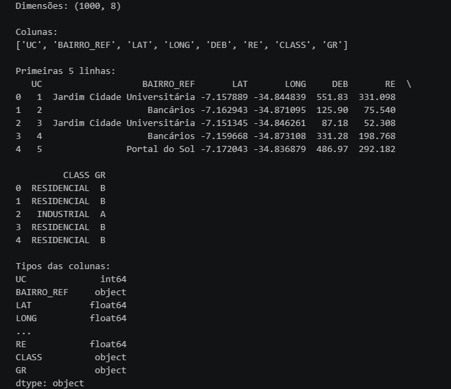
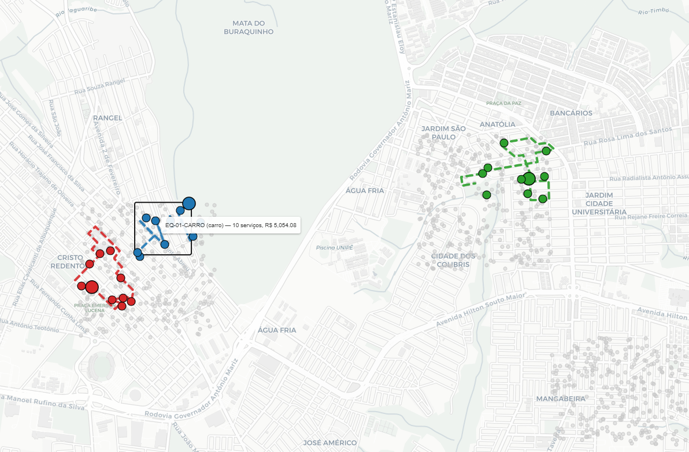

Problemas de roteirização são um tema clássico em Supply Chain, Pesquisa Operacional, com ampla aplicação no segmento de distribuição de utilities. Em linhas gerais, esses problemas buscam determinar rotas otimizadas para atendimento de um conjunto de pontos, considerando restrições financeiras/operacionais e objetivos como a otimização de receita, redução de custos e eficiência operacional.

Para esse projeto pessoal, utilizei LLM para geração de dados sintéticos de georreferenciamento no município de João Pessoa-PB. O objetivo principal é otimizar a rota simultânea de três equipes para a realização de serviços de suspensão de energia. Como dado, além da simulação das informações de posição (latitude e longitude), solicitei geração de dados referentes ao valor devido e o valor esperado de recuperação (que pode vir, a princípio, de modelagem preditiva).

O problema, no fundo, é uma variação do Prize-Collecting Travelling Salesman Problem: em vez de visitar todos os pontos, cada equipe parte de um ponto inicial (semente), definindo o roteiro e as paradas que valem a pena dentro de *bounds* de distância máxima percorrida, a capacidade de serviços e a penalização pela própria distância percorrida. A função objetivo maximiza o valor total recuperado menos o custo do deslocamento, respeitando as restrições e sem sobreposição de área entre equipes de mesma natureza (equipes que possuem mesma característica como carro e ferramentas).

Entre as técnicas usadas, o OR-Tools foi utilizado em dois momentos (um solver de roteamento para gerar as rotas candidatas a partir de cada semente e para a escolha da melhor combinação de rotas sem conflitos e sobreposição de equipes). **Um grande diferencial** desse modelo para os tradicionais está na escolha das sementes (ou ponto inicial de partida da roteirização): em vez da seleção aleatória e necessariamente alta de pontos iniciais, foi utilizada um algoritmo de machine learning não supervisionado, **DBSCAN**, que realiza clusterização. O clustering identifica de forma exaustiva as regiões mais densas de valor a recuperar, e essa troca nos testes levou o valor estimado a recuperar de **R$ 26 mil para R$ 39 mil (cerca de 53% a mais)**.

Outro diferencial desse otimizador está na abertura para conexão com APIs de georreferenciamento. Devido ao limite de requisições gratuitas para essa PoC, foi feito o download da malha viária e processamento offline dos dados (link para download: https://download.geofabrik.de/south-america/brazil.html). Essa técnica faz com que o otimizador consiga calcular a distância sobrepondo a malha viária em vez de considerar apenas a distância euclidiana utilizando a técnica de Haversine, como em métodos mais tradicionais.

Abaixo segue as três rotas definidas para cada equipe.

Ao final, temos um modelo de roteirização, com a possibilidade de parametrização de dados como o raio para definição de sementes, a distância percorrida, o custo do km percorrido etc. A utilização das técnicas acima permitiu a definição de um roteiro otimizado que potencializa os resultados.

Link para o projeto no meu repositório Github: https://github.com/alonsoguimaraesmarcos/roteirizacao-servicos

Observações:

1. Todo o processo foi realizado e encapsulado dentro de um ambiente virtual, com as bibliotecas definidas para evitar qualquer incompatibilidade entre versões, estando disponível no arquivo de requirements.txt

2. Um detalhe para colocar projetos desse porte para rodar: uma das bibliotecas usadas para processamento dos dados cartográficos depende de um pacote sem instalador pronto para Windows (Visual C++ Build Tools). A saída mais simples foi migrar para o Conda com o Miniforge (sugestão da Claude), que já traz a dependência compilada. 